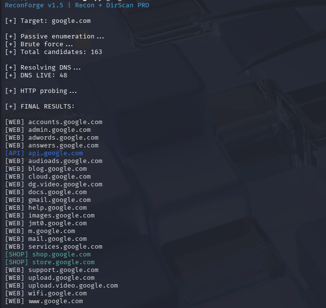
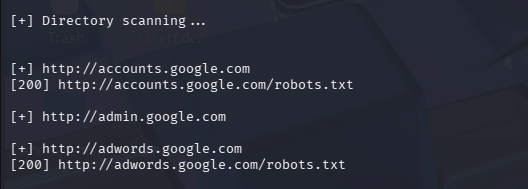

# 🚀 ReconForge

**Version: v1.5**

Fast Recon Tool for **Subdomain Enumeration + Directory Scanning**

---

## ⚡ Overview

ReconForge is a lightweight reconnaissance tool built for:

* Subdomain enumeration (passive + brute-force)
* DNS resolution
* HTTP probing
* Basic directory scanning

It is designed for **speed, simplicity, and clean output**, making it useful for quick recon tasks and automation.

---

## 🔥 Features

* 🔍 Passive subdomain enumeration (crt.sh)
* 💣 Brute-force subdomain discovery
* 🌐 DNS resolution filtering
* ⚡ Fast HTTP probing
* 📂 Optional directory scanning (`--dir`)
* 🎯 Categorized output (WEB, API, AUTH, SHOP, CDN)
* 🤫 Silent mode (script-friendly)

---

## 🛠 Installation

### 1. Clone repository

```bash
git clone https://github.com/shhaheerr/ReconForge.git
cd ReconForge
```

---

### 2. Install dependencies

#### ✅ Option A (Kali Linux - Recommended)

```bash
sudo apt install python3-colorama
```

---

#### ✅ Option B (Virtual Environment - Recommended for all systems)

```bash
python3 -m venv venv
source venv/bin/activate
pip install -r requirements.txt
```

---

#### ⚠️ Option C (Not recommended)

```bash
pip3 install -r requirements.txt --break-system-packages
```

---

## 🚀 Usage

### Basic scan

```bash
python3 reconforge.py target.com
```

---

### Silent mode

```bash
python3 reconforge.py target.com --silent
```

---

### Save output

```bash
python3 reconforge.py target.com -o results.txt
```

---

### Thread control

```bash
python3 reconforge.py target.com --threads 50
```

---

### Directory scanning

```bash
python3 reconforge.py target.com --dir
```

---

### Scan IP / URL

```bash
python3 reconforge.py http://target-ip --dir
```

---

## 🖥 CLI Usage (Optional)

Run ReconForge like a command:

```bash
chmod +x reconforge.py
cp reconforge.py ~/bin/reconforge
```

Then:

```bash
reconforge target.com
```

---

## 📸 Screenshots

### 🔹 Recon Mode



### 🔹 Directory Scan Mode



---

## ⚠️ Limitations

### 📂 Directory Scanning

* Uses basic wordlist brute-force
* May produce **false positives**
* Some servers return `200 OK` for all paths

👉 For accurate fuzzing, consider tools like:

* ffuf
* dirsearch

---

### 🌐 Passive Enumeration

* Primarily uses crt.sh
* Results may vary depending on availability

---

### ⚡ Scope

ReconForge is **not a full recon framework**.
It is designed for **fast and simple recon tasks**, not deep scanning.

---

## 📁 Project Structure

```
reconforge.py      → Main tool
passive.py         → Passive enumeration
brute.py           → Subdomain brute force
resolver.py        → DNS resolution
http_probe.py      → HTTP probing
dirscan.py         → Directory scanning
wordlist.txt       → Subdomain wordlist
dirs.txt           → Directory wordlist
```

---

## 🧪 Example Output

```
[WEB] admin.google.com
[API] api.google.com
[SHOP] store.google.com
```

---

## ⚠️ Disclaimer

This tool is intended for **educational purposes and authorized testing only**.
The author is not responsible for misuse.

---

## 👤 Author

GitHub: https://github.com/shhaheerr

---

## ⭐ Support

If you find this tool useful, consider giving it a ⭐

---

## 🚧 Future Improvements

* Reduce directory scan false positives
* Add more passive sources
* Improve performance (async scanning)
* Smarter filtering and detection
